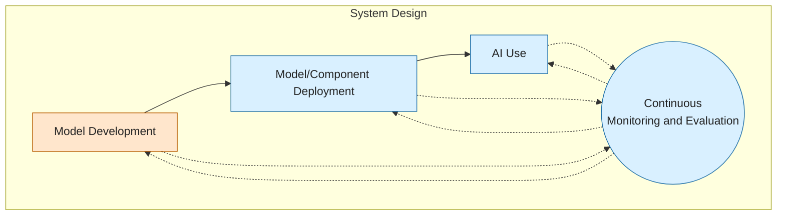
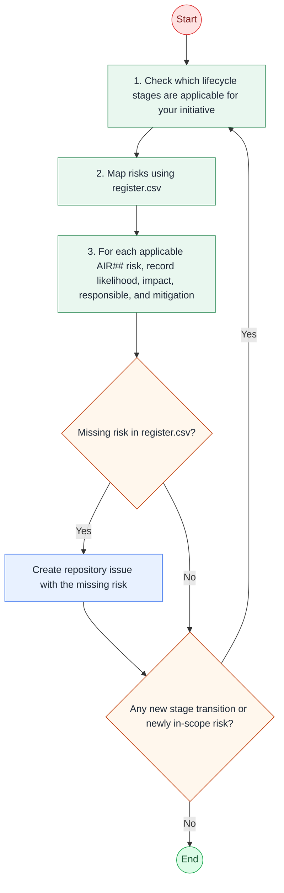

# Really Simple AI Risk Framework (RSAIRF)

**Really Simple AI Risk Framework** is your go to tool to identify and mitigate AI/ML-specific risks. The AI Risk Register of this framework is carefully curated based on various sources and internal incident learnings of our clients.

## AI Lifecycle

Every AI initiative moves through lifecycle stages such as Development, Deployment, Use, and Monitoring. Not every organization develops AI models, but all AI initiatives involve Deployment and Use. Gaps in Monitoring and shadow Deployments are common sources of risk.

- **Development**: You design or materially change AI behavior (for example, selecting data, training, tuning, evaluation).
- **Deployment**: You do not build the model, but you integrate, configure, and release AI components into production workflows.
- **Use**: You consume a deployed AI solution in business operations and make decisions or actions based on its outputs (via chat, CLI, or another interface).
- **Monitoring**: You track risk, quality, and incidents over time; this is continuous and should run across all other stages.

## How to use this framework?

1. Check which lifecycle stages are applicable for your initiative. If unclear, run a discovery session with your technical team.
2. For the stage(s) your initiative is currently in, consult the [register.csv](./register.csv). Stage tags in the risk register indicate where each risk is typically introduced or first exploitable. Several risks span more than one stage and are tagged accordingly.
3. For every risk that applies to your system, record: likelihood, impact, an owner, and a mitigation or control. Reference risks by their AIR## ID in your project’s risk log, security review, or audit so findings stay traceable back to this register. “AIR” stands for AI Risk.

> Re-check the register at each stage transition (e.g., moving from Development to Deployment) — a risk that was out of scope earlier may now apply.

> Treat this as a living list: if you identify a risk not represented here, propose it by [creating an issue](https://github.com/OpenEthicsAI/RSAIRF/issues/new) in this repository, your contribution may help other teams.

## License

This work is licensed under the Creative Commons Attribution 4.0
International License [CC BY 4.0](./LICENSE).
